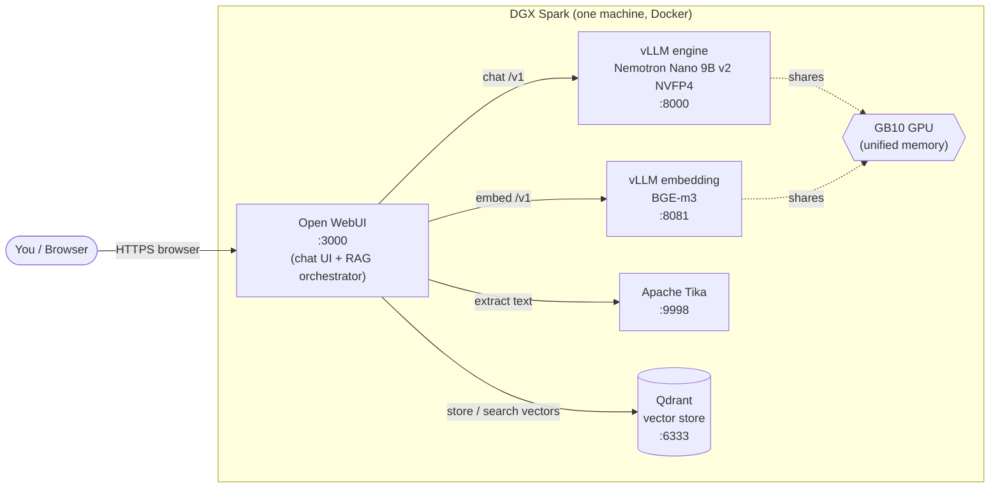
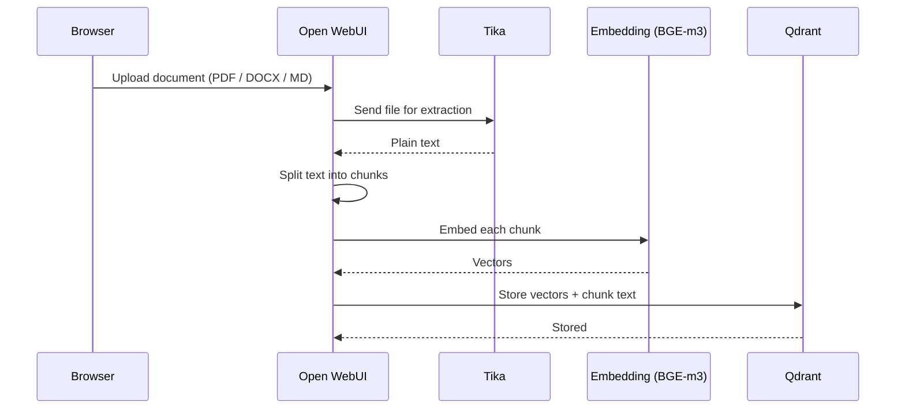
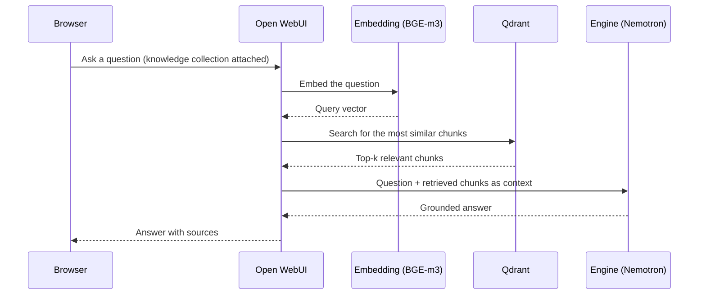

# HNBK KI-Workshop: Local RAG Infrastructure

A self-contained, local Retrieval-Augmented Generation (RAG) stack for the
NVIDIA DGX Spark. It runs an open-source language model, a chat interface, and a
document knowledge base entirely on one machine, with no data leaving the box and
no external API keys required.

Clone it onto a DGX Spark, bring it up with one command, upload your documents,
and ask questions that are answered from those documents.

## What's inside

Five Docker services, all on the GPU box:

| Service | Role |
| --- | --- |
| `engine` | vLLM serving the chat model (`nvidia/NVIDIA-Nemotron-Nano-9B-v2-NVFP4`) on the GPU |
| `vllm-embedding` | vLLM serving `BAAI/bge-m3`, turns text into vectors |
| `qdrant` | Vector database: stores and searches the document vectors |
| `tika` | Apache Tika: extracts text from PDF, DOCX, and other formats |
| `open-webui` | The chat UI and the RAG orchestrator that ties the others together |

You only ever interact with Open WebUI in the browser. It calls Tika to read an
uploaded document, chunks the text, calls the embedding service, stores the
vectors in Qdrant, and at question time retrieves the relevant chunks and feeds
them to the chat model.

## How it works

The topology below shows the five services and how they connect on the Docker
network. You only ever touch Open WebUI in the browser; the rest is internal.



When you upload a document, Open WebUI runs this ingest flow once:



When you ask a question with a knowledge collection attached, it runs this:



## Prerequisites

- An NVIDIA DGX Spark (GB10) with the GPU available to Docker.
- Docker Engine and the Docker Compose plugin.
- The NVIDIA Container Toolkit (so containers can see the GPU).
- Network access on first run to download the container images and the model.

Check the GPU is visible to Docker:

```bash
docker run --rm --gpus all nvcr.io/nvidia/vllm:25.10-py3 nvidia-smi -L
```

## Run it

```bash
git clone <repo-url> hnbk-ki-workshop
cd hnbk-ki-workshop
cp .env.example .env        # defaults work as-is; no token needed
docker compose up -d
docker compose ps           # wait until engine and vllm-embedding are "healthy"
```

The first start downloads the chat model (several GB) and the embedding model, so
it takes a while. Watch progress with `docker compose logs -f engine`. Once the
engine and embedding services show `healthy`, open:

```
http://localhost:3000
```

The first account you create becomes the administrator.

## First use

1. Open `http://localhost:3000` and create your admin account.
2. Pick the Nemotron model in the chat and ask a question to confirm the model
   answers.
3. Create a Knowledge collection (Workspace -> Knowledge) and upload a document
   (PDF, DOCX, Markdown, ...). Open WebUI sends it through Tika and indexes it.
4. Start a chat, attach the Knowledge collection to your message, and ask a
   question about the document. The answer is generated from the retrieved text.

## Running on a laptop instead (no DGX Spark)

If you don't have a DGX Spark, there's a second compose file that runs the same
RAG stack on a normal laptop using [Ollama](https://ollama.com) on the CPU instead
of vLLM on the GPU. Ollama serves both the chat model and the embeddings, so it's
four services instead of five, and no GPU is required.

It fits a machine with about 16 GB of RAM. The chat model is `gemma4:e4b-it-qat`
(Gemma 4 E4B, 4-bit, ~6 GB); embeddings stay on `bge-m3`.

```bash
cp .env.laptop.example .env.laptop
docker compose -f compose.laptop.yml --env-file .env.laptop up -d
docker compose -f compose.laptop.yml ps    # wait until services are up
# first start pulls Gemma 4 E4B (~6 GB) and bge-m3 into Ollama
# then open http://localhost:3000
```

From there the usage is identical to the steps in **First use** above. Two things
to expect:

- On CPU this is noticeably slower than the Spark, a handful of tokens per second.
  Fine for learning and experimenting, not for a snappy demo.
- On a Mac, Docker cannot use the Apple GPU (Metal), so it runs CPU-only inside the
  container. For more speed, Mac users can install Ollama natively and point Open
  WebUI at it instead.

Gemma 4 E4B is a normal instruct model, so unlike the Spark's Nemotron it does not
show a separate "thinking" step.

## A note on the model's "thinking"

Nemotron Nano is a reasoning model: by default it works through a problem step by
step before answering. The engine is configured with a reasoning parser, so Open
WebUI shows that reasoning in a collapsible "Thinking" panel and the clean answer
underneath. The trade-off is a slower time-to-first-token while it thinks.

You can run the same model without the reasoning step for faster replies by
sending `/no_think` in the system prompt or message. See
`docs/Dependency Intelligence.md` for how to set up a "fast" model preset in Open
WebUI alongside the default reasoning one.

## Stopping and resetting

```bash
docker compose down              # stop the stack, keep data and models
docker compose down -v           # also delete vectors, chats, and the model cache
```

## Configuration

All knobs live in `.env` (copied from `.env.example`): image versions, the chat
and embedding model ids, the per-service GPU memory fractions, and the host
ports. Image versions are pinned for reproducibility; change them deliberately
and re-test.

## Troubleshooting

- **A service won't go healthy / first start is slow:** the model is still
  downloading. Check `docker compose logs -f engine`.
- **Out-of-memory on the GPU:** lower `CHAT_GPU_FRACTION` in `.env` (the chat
  engine and the embedding service share the one GPU) and `docker compose up -d`
  again.
- **Port already in use:** another service holds 3000/8000/8081/6333/9998. Change
  the matching port in `.env`.

## Project documentation

- `docs/specs/` — the design spec (what this is and why it was built this way).
- `docs/plans/` — the implementation plan.
- `docs/Dependency Intelligence.md` — pinned versions, model choices, and the
  current state of the vLLM / DGX Spark / model dependencies.
- `AGENTS.md` — guidance for anyone (human or AI) working on this repo.
