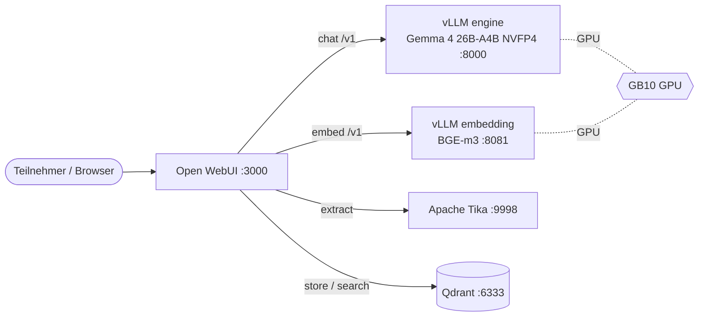
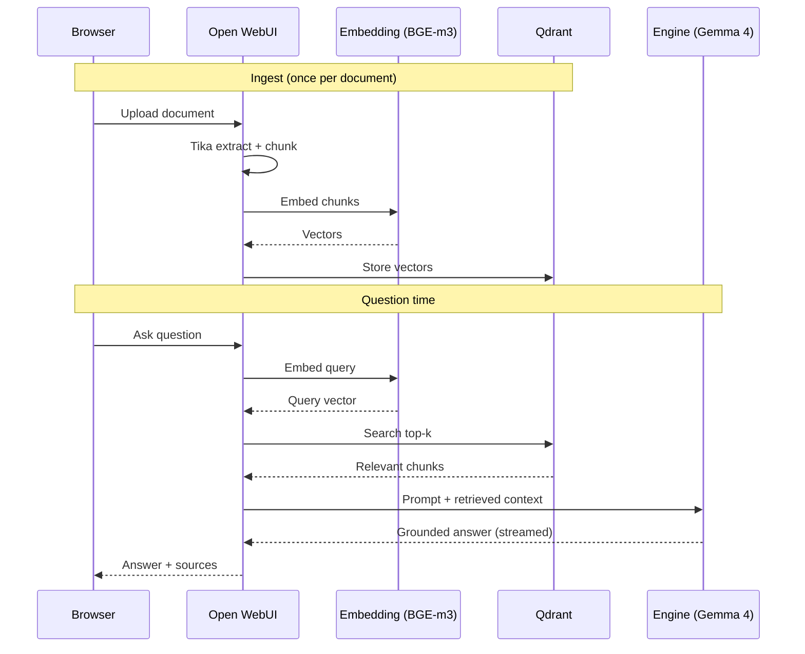

# RAG Infrastructure Showcase Implementation Plan

> **For agentic workers:** REQUIRED SUB-SKILL: Use superpowers:subagent-driven-development (recommended) or superpowers:executing-plans to implement this plan task-by-task. Steps use checkbox (`- [ ]`) syntax for tracking.

**Goal:** Build a self-contained Docker Compose RAG stack that a workshop participant clones onto their own NVIDIA DGX Spark and brings up with one command.

**Architecture:** Five services on one GPU box. Open WebUI is the chat UI and the RAG orchestrator; it calls Apache Tika to extract uploaded documents, an embedding vLLM service (BGE-m3) to vectorize, Qdrant to store and search vectors, and a chat vLLM service (Gemma 4 26B-A4B NVFP4) to generate grounded answers. Monitoring and load-testing from the full proposal architecture are out of scope.

**Tech Stack:** Docker Compose, vLLM (NVFP4 on GB10 Blackwell), Qdrant, Apache Tika, Open WebUI, Gemma 4 26B-A4B-it NVFP4, BAAI/bge-m3.

**Source of truth:** `docs/specs/2026-06-10-rag-infra-design.md`.

**Where this runs:** Every step that boots a service must run on the DGX Spark host (ARM aarch64, GB10 GPU). The model is ~16.5 GB and downloads on first boot, so expect long pulls. Verification "tests" here are container-up + endpoint probes, not unit tests; that is the right shape for an infra stack.

---

## File structure

Public infra repo (`~/hnbk-ki-workshop`):

```
compose.yml                # all five services, parameterized via .env
.env.example               # image tags, model ids, GPU fractions, ports
.gitignore                 # already in place (ignores .env, *.docx, caches)
README.md                  # participant-facing run + usage guide
AGENTS.md                  # governance for future agents in this repo
patches/                   # vendored model patch(es) if Task 1 needs them
docs/
  specs/2026-06-10-rag-infra-design.md       # already committed
  plans/2026-06-10-rag-infra-implementation.md  # this file
  Dependency Intelligence.md                 # pinned versions + rationale
```

Private teaching repo (`~/hnbk-ki-workshop-teaching`, separate git repo, never pushed publicly):

```
proposal/2026-03-10-angebot-ki-workshop-v2.docx   # moved from the infra folder
topology.md                # Mermaid component/topology diagram
sequence.md                # Mermaid RAG query sequence diagram
open-webui-usage.md        # presentation walkthrough
```

---

## Task 1: Boot-confirm the Gemma 4 NVFP4 chat model (gating spike)

This task resolves the spec's main open risk before any compose is written. Its output is a set of confirmed values (image, checkpoint, flags, patch-or-not) that every later task consumes through `.env`. Do not proceed to Task 2 until the model answers a chat request.

**Files:**
- Create (if needed): `~/hnbk-ki-workshop/patches/gemma4.py`
- Scratch notes: append findings to `docs/Dependency Intelligence.md` (created in Task 10; for now keep notes in the task checklist)

- [ ] **Step 1: Pull the candidate image and confirm the checkpoint is ungated**

Primary checkpoint: `nvidia/Gemma-4-26B-A4B-NVFP4`, confirmed on 2026-06-10 as
both instruction-tuned (its `base_model` is `gemma-4-26B-A4B-it`) and ungated
(Apache-2.0, downloads with no token). `bg-digitalservices/Gemma-4-26B-A4B-it-NVFP4`
is an equivalent ungated alternate if NVIDIA's checkpoint has issues.

```bash
docker pull vllm/vllm-openai:gemma4-cu130
# Re-confirm the checkpoint is ungated at build time:
python3 - <<'PY'
from huggingface_hub import HfApi
api = HfApi()
info = api.model_info("nvidia/Gemma-4-26B-A4B-NVFP4")
print("gated:", info.gated, "| license:", info.cardData.get("license"))
PY
```
Expected: image pulls; `gated: False`. **User rule (2026-06-10): if the chosen
Gemma checkpoint is gated, do not use any other gated Gemma variant. Switch
straight to `RedHatAI/Qwen3.6-35B-A3B-NVFP4` (Qwen3 is Apache-2.0, ungated).**

- [ ] **Step 2: Run the chat model standalone (no compose yet)**

```bash
docker run -d --name gemma4-spike \
  --gpus all --ipc host --shm-size 64gb \
  -p 8000:8000 \
  -v ~/.cache/huggingface:/root/.cache/huggingface \
  vllm/vllm-openai:gemma4-cu130 \
  --model nvidia/Gemma-4-26B-A4B-NVFP4 \
  --served-model-name gemma-4-26b \
  --host 0.0.0.0 --port 8000 \
  --quantization modelopt \
  --kv-cache-dtype fp8 \
  --max-model-len 131072 \
  --gpu-memory-utilization 0.85 \
  --moe-backend marlin \
  --reasoning-parser gemma4 \
  --enable-auto-tool-choice --tool-call-parser pythonic
```

- [ ] **Step 3: Watch logs until the server is ready or fails**

```bash
docker logs -f gemma4-spike
```
Expected: `Application startup complete` / `Uvicorn running on http://0.0.0.0:8000`. If it fails with a missing/incompatible `gemma4.py` model file, extract the patched model file referenced in the ai-muninn recipe, save it to `~/hnbk-ki-workshop/patches/gemma4.py`, and re-run Step 2 adding:
```
  -v ~/hnbk-ki-workshop/patches/gemma4.py:/usr/local/lib/python3.12/dist-packages/vllm/model_executor/models/gemma4.py
```
Record whether the patch was needed.

- [ ] **Step 4: Verify it serves and answers**

```bash
curl -s http://localhost:8000/v1/models | python3 -m json.tool
curl -s http://localhost:8000/v1/chat/completions \
  -H 'Content-Type: application/json' \
  -d '{"model":"gemma-4-26b","messages":[{"role":"user","content":"Reply with the single word: ok"}],"max_tokens":10}' \
  | python3 -m json.tool
```
Expected: `/v1/models` lists `gemma-4-26b`; the chat call returns a completion containing "ok".

- [ ] **Step 5: Decision gate — record the confirmed values or trigger the fallback**

Write down, for use in `.env` (Task 8):
- `ENGINE_IMAGE` = the working image (pin to a digest: `docker inspect --format='{{index .RepoDigests 0}}' vllm/vllm-openai:gemma4-cu130`)
- `CHAT_MODEL` = the confirmed checkpoint id
- the exact serve flags that worked
- whether `patches/gemma4.py` is required

If the model will not serve, record the reason and pick the fallback by cause:
- **Gated checkpoint (user rule, 2026-06-10):** switch straight to
  `RedHatAI/Qwen3.6-35B-A3B-NVFP4` (Apache-2.0, ungated). Do not chase another
  gated Gemma variant.
- **Boot/image failure (not gating):** first try mounting `patches/gemma4.py`
  (Step 3), then the alternate ungated instruct checkpoint
  `bg-digitalservices/Gemma-4-26B-A4B-it-NVFP4`, then
  `RedHatAI/Qwen3.6-35B-A3B-NVFP4`. Qwen3.6 NVFP4 carries the same special-image
  caveat, so if both NVFP4 paths prove too fragile for a clone-and-run repo, drop
  to an FP8 checkpoint on a stock NGC vLLM image, accepting lower throughput.

Surface the fallback choice to the user before continuing.

- [ ] **Step 6: Tear down the spike**

```bash
docker rm -f gemma4-spike
```
No commit in this task; it produces values, not files (unless a patch was vendored, which is committed in Task 2 alongside the engine service).

---

## Task 2: Compose with the chat engine only

**Files:**
- Create: `~/hnbk-ki-workshop/compose.yml`
- Create (if Task 1 required it): `~/hnbk-ki-workshop/patches/gemma4.py`

- [ ] **Step 1: Write `compose.yml` with just the engine**

Use the values confirmed in Task 1. If no patch was needed, delete the `volumes` patch line.

```yaml
services:
  engine:
    image: vllm/vllm-openai:gemma4-cu130
    container_name: engine
    command: >
      --model nvidia/Gemma-4-26B-A4B-NVFP4
      --served-model-name gemma-4-26b
      --host 0.0.0.0 --port 8000
      --quantization modelopt
      --kv-cache-dtype fp8
      --max-model-len 131072
      --gpu-memory-utilization 0.80
      --moe-backend marlin
      --reasoning-parser gemma4
      --enable-auto-tool-choice --tool-call-parser pythonic
    ports: ["8000:8000"]
    restart: unless-stopped
    ipc: host
    shm_size: "64gb"
    volumes:
      - hf-cache:/root/.cache/huggingface
      - ./patches/gemma4.py:/usr/local/lib/python3.12/dist-packages/vllm/model_executor/models/gemma4.py
    deploy:
      resources:
        reservations:
          devices:
            - driver: nvidia
              capabilities: [gpu]
    healthcheck:
      test: ["CMD-SHELL", "curl -sf http://localhost:8000/health || exit 1"]
      interval: 15s
      timeout: 10s
      retries: 80
      start_period: 300s

volumes:
  hf-cache:
```

Note: `gpu-memory-utilization` is dropped to `0.80` here (from the recipe's 0.85) to leave room for the embedding service added in Task 3.

- [ ] **Step 2: Bring up the engine and wait for healthy**

```bash
cd ~/hnbk-ki-workshop && docker compose up -d engine
watch -n 5 'docker compose ps engine'
```
Expected: `engine` reaches `healthy` (first boot is slow; the model is already cached from Task 1).

- [ ] **Step 3: Probe the endpoint**

```bash
curl -s http://localhost:8000/v1/chat/completions \
  -H 'Content-Type: application/json' \
  -d '{"model":"gemma-4-26b","messages":[{"role":"user","content":"Reply with: ok"}],"max_tokens":10}' \
  | python3 -m json.tool
```
Expected: a completion containing "ok".

- [ ] **Step 4: Commit**

```bash
cd ~/hnbk-ki-workshop
git add compose.yml patches/ 2>/dev/null; git add compose.yml
git commit -m "Add chat engine service (Gemma 4 26B-A4B NVFP4)"
```

---

## Task 3: Add the embedding service (BGE-m3) and validate GPU co-location

**Files:**
- Modify: `~/hnbk-ki-workshop/compose.yml`

- [ ] **Step 1: Add the `vllm-embedding` service**

Append under `services:` (keep `volumes:` at the bottom). The embedding image is parameterized separately because BGE-m3 is not NVFP4 and the proven image for it in the source project is the stock NGC vLLM; if Task 1's `gemma4-cu130` image also serves pooling embeddings, the two can be unified later.

```yaml
  vllm-embedding:
    image: nvcr.io/nvidia/vllm:25.10-py3
    container_name: vllm-embedding
    entrypoint: ["vllm", "serve"]
    command: >
      BAAI/bge-m3
      --host 0.0.0.0 --port 8081
      --runner pooling
      --max-model-len 2000
      --gpu-memory-utilization 0.10
      --download-dir /root/.cache/huggingface
    ports: ["8081:8081"]
    restart: unless-stopped
    ipc: host
    environment:
      HF_HOME: /root/.cache/huggingface
      TOKENIZERS_PARALLELISM: "false"
    volumes:
      - hf-cache:/root/.cache/huggingface
    deploy:
      resources:
        reservations:
          devices:
            - driver: nvidia
              capabilities: [gpu]
    healthcheck:
      test: ["CMD-SHELL", "curl -sf http://localhost:8081/health || exit 1"]
      interval: 15s
      timeout: 10s
      retries: 60
      start_period: 180s
```

- [ ] **Step 2: Bring up both GPU services together and watch for OOM**

```bash
cd ~/hnbk-ki-workshop && docker compose up -d engine vllm-embedding
docker compose logs -f engine vllm-embedding
nvidia-smi
```
Expected: both reach `healthy`; no CUDA out-of-memory in either log. If the engine OOMs, lower its `--gpu-memory-utilization` to `0.75` in `compose.yml` and retry. Record the working split.

- [ ] **Step 3: Probe the embedding endpoint**

```bash
curl -s http://localhost:8081/v1/embeddings \
  -H 'Content-Type: application/json' \
  -d '{"model":"BAAI/bge-m3","input":"hallo welt"}' \
  | python3 -c 'import sys,json; d=json.load(sys.stdin); print("dims:", len(d["data"][0]["embedding"]))'
```
Expected: prints a vector dimension (1024 for bge-m3).

- [ ] **Step 4: Commit**

```bash
cd ~/hnbk-ki-workshop && git add compose.yml
git commit -m "Add BGE-m3 embedding service; validate GPU co-location"
```

---

## Task 4: Add Qdrant

**Files:**
- Modify: `~/hnbk-ki-workshop/compose.yml`

- [ ] **Step 1: Add the `qdrant` service and its volume**

```yaml
  qdrant:
    image: qdrant/qdrant:v1.12.4
    container_name: qdrant
    ports: ["6333:6333", "6334:6334"]
    restart: unless-stopped
    volumes:
      - qdrant_storage:/qdrant/storage
```
Add `qdrant_storage:` under the top-level `volumes:` block. (Pin to the current stable tag; confirm the latest patch tag on Docker Hub during Step 2 and update if newer.)

- [ ] **Step 2: Bring up and probe**

```bash
cd ~/hnbk-ki-workshop && docker compose up -d qdrant
curl -s http://localhost:6333/healthz; echo
curl -s http://localhost:6333/collections | python3 -m json.tool
```
Expected: `healthz` returns ok; `/collections` returns an empty result list.

- [ ] **Step 3: Commit**

```bash
cd ~/hnbk-ki-workshop && git add compose.yml
git commit -m "Add Qdrant vector store"
```

---

## Task 5: Add Apache Tika

**Files:**
- Modify: `~/hnbk-ki-workshop/compose.yml`

- [ ] **Step 1: Add the `tika` service**

```yaml
  tika:
    image: apache/tika:3.2.1.0-full
    container_name: tika
    ports: ["9998:9998"]
    restart: unless-stopped
```
(Pin to the current `-full` tag; confirm on Docker Hub during Step 2.)

- [ ] **Step 2: Bring up and probe**

```bash
cd ~/hnbk-ki-workshop && docker compose up -d tika
curl -s http://localhost:9998/version; echo
printf 'hello tika' | curl -s -T - http://localhost:9998/tika; echo
```
Expected: a version string; the second call echoes extracted text "hello tika".

- [ ] **Step 3: Commit**

```bash
cd ~/hnbk-ki-workshop && git add compose.yml
git commit -m "Add Apache Tika document extraction"
```

---

## Task 6: Add Open WebUI wired to all four backends

**Files:**
- Modify: `~/hnbk-ki-workshop/compose.yml`

- [ ] **Step 1: Verify the exact Open WebUI env var names for the pinned version**

Open WebUI's RAG env var names change across versions, so confirm them against the docs for the tag being pinned before trusting the snippet below. Check the docs for: chat backend (`OPENAI_API_BASE_URL`), vector DB (`VECTOR_DB`, `QDRANT_URI`), embedding engine (`RAG_EMBEDDING_ENGINE`, `RAG_OPENAI_API_BASE_URL`, `RAG_EMBEDDING_MODEL`), and content extraction (`CONTENT_EXTRACTION_ENGINE`, `TIKA_SERVER_URL`).

```bash
# Reference: https://docs.openwebui.com/getting-started/env-configuration/
```

- [ ] **Step 2: Add the `open-webui` service**

```yaml
  open-webui:
    image: ghcr.io/open-webui/open-webui:v0.6.18
    container_name: open-webui
    ports: ["3000:8080"]
    restart: unless-stopped
    environment:
      # Chat backend
      OPENAI_API_BASE_URL: http://engine:8000/v1
      OPENAI_API_KEY: "sk-no-key-required"
      # Vector store
      VECTOR_DB: qdrant
      QDRANT_URI: http://qdrant:6333
      # Embeddings via the external vLLM embedding service
      RAG_EMBEDDING_ENGINE: openai
      RAG_OPENAI_API_BASE_URL: http://vllm-embedding:8081/v1
      RAG_OPENAI_API_KEY: "sk-no-key-required"
      RAG_EMBEDDING_MODEL: BAAI/bge-m3
      # Document extraction via Tika
      CONTENT_EXTRACTION_ENGINE: tika
      TIKA_SERVER_URL: http://tika:9998
      ENABLE_WEB_LOADER_SSL_VERIFICATION: "false"
    volumes:
      - open-webui-data:/app/backend/data
    depends_on: [engine, vllm-embedding, qdrant, tika]
```
Add `open-webui-data:` under the top-level `volumes:` block. (Pin to the current stable Open WebUI release tag confirmed in Step 1.)

- [ ] **Step 3: Bring up the full stack**

```bash
cd ~/hnbk-ki-workshop && docker compose up -d
watch -n 5 'docker compose ps'
```
Expected: all five services `running`/`healthy`.

- [ ] **Step 4: Confirm the UI is reachable**

```bash
curl -s -o /dev/null -w "%{http_code}\n" http://localhost:3000/
```
Expected: `200`.

- [ ] **Step 5: Commit**

```bash
cd ~/hnbk-ki-workshop && git add compose.yml
git commit -m "Add Open WebUI orchestrator wired to engine, embedding, Qdrant, Tika"
```

---

## Task 7: End-to-end RAG smoke test

**Files:**
- Create: `docs/VALIDATION.md` (records the smoke-test result)

- [ ] **Step 1: Create an admin account and a small test document**

In the browser at `http://localhost:3000`, create the first account (becomes admin). Create a throwaway text file with a fact the model could not otherwise know, for example: `Die internen Server der HNBK-Werkstatt heißen Spark-Alpha und Spark-Beta.`

- [ ] **Step 2: Upload the document and ask a grounded question**

In a new chat, attach the document (or add it to a Knowledge collection), then ask: `Wie heißen die internen Server der HNBK-Werkstatt?`
Expected: the answer names Spark-Alpha and Spark-Beta and shows a citation/source reference to the uploaded document. This proves Tika extraction, embedding, Qdrant retrieval, and grounded generation all work end to end.

- [ ] **Step 3: Confirm the vector landed in Qdrant**

```bash
curl -s http://localhost:6333/collections | python3 -m json.tool
```
Expected: at least one collection now exists.

- [ ] **Step 4: Record the result and commit**

Write `docs/VALIDATION.md` with the date, the exact question/answer, whether a citation appeared, and the working GPU split and image tags. Then:
```bash
cd ~/hnbk-ki-workshop && git add docs/VALIDATION.md
git commit -m "Record end-to-end RAG smoke test result"
```

---

## Task 8: Parameterize compose and write `.env.example`

**Files:**
- Create: `~/hnbk-ki-workshop/.env.example`
- Modify: `~/hnbk-ki-workshop/compose.yml`

- [ ] **Step 1: Write `.env.example` with the confirmed values**

Pin images to digests where Task 1/Steps confirmed them. Defaults must work as-is with no edits.

```dotenv
# Images (pinned for reproducibility)
ENGINE_IMAGE=vllm/vllm-openai:gemma4-cu130
EMBEDDING_IMAGE=nvcr.io/nvidia/vllm:25.10-py3
QDRANT_IMAGE=qdrant/qdrant:v1.12.4
TIKA_IMAGE=apache/tika:3.2.1.0-full
OPENWEBUI_IMAGE=ghcr.io/open-webui/open-webui:v0.6.18

# Models
CHAT_MODEL=nvidia/Gemma-4-26B-A4B-NVFP4
CHAT_SERVED_NAME=gemma-4-26b
EMBEDDING_MODEL=BAAI/bge-m3

# GPU memory split (chat + embedding must sum < 1.0 with headroom)
CHAT_GPU_FRACTION=0.80
EMBED_GPU_FRACTION=0.10

# Ports
ENGINE_PORT=8000
EMBED_PORT=8081
QDRANT_PORT=6333
WEBUI_PORT=3000
```

- [ ] **Step 2: Replace literals in `compose.yml` with `${VAR}` references**

Swap `image:` lines and the relevant `command`/`environment`/`ports` literals for the `.env` variables (for example `image: ${ENGINE_IMAGE}`, `--gpu-memory-utilization ${CHAT_GPU_FRACTION}`, `ports: ["${WEBUI_PORT}:8080"]`).

- [ ] **Step 3: Verify the config resolves**

```bash
cd ~/hnbk-ki-workshop && cp .env.example .env && docker compose config >/dev/null && echo "compose config OK"
docker compose up -d && docker compose ps
```
Expected: `compose config OK`; stack still comes up healthy with the parameterized file.

- [ ] **Step 4: Commit**

```bash
cd ~/hnbk-ki-workshop && git add .env.example compose.yml
git commit -m "Parameterize compose via .env.example with pinned images"
```

---

## Task 9: Participant-facing README

**Files:**
- Create: `~/hnbk-ki-workshop/README.md`

- [ ] **Step 1: Write the README**

Cover, in plain language: what the stack is (one paragraph), prerequisites (a DGX Spark with Docker and the NVIDIA Container Toolkit, GPU visible to Docker), the run steps, what to expect on first boot (long model download), how to open the UI, a two-line "first use" pointer (create the admin account, upload a document, ask a question), and a short troubleshooting section (model still downloading, GPU OOM means lower `CHAT_GPU_FRACTION`, ports already in use). Include the exact block:

```bash
git clone <repo-url>
cd hnbk-ki-workshop
cp .env.example .env        # defaults work as-is; no token needed
docker compose up -d
docker compose ps           # wait until all services are healthy
# open http://localhost:3000
```

- [ ] **Step 2: Sanity-check the commands match the repo**

```bash
cd ~/hnbk-ki-workshop && grep -q 'cp .env.example .env' README.md && test -f .env.example && echo "README run block consistent"
```
Expected: prints the confirmation.

- [ ] **Step 3: Commit**

```bash
cd ~/hnbk-ki-workshop && git add README.md
git commit -m "Add participant-facing README"
```

---

## Task 10: AGENTS.md and Dependency Intelligence note

**Files:**
- Create: `~/hnbk-ki-workshop/AGENTS.md`
- Create: `~/hnbk-ki-workshop/docs/Dependency Intelligence.md`

- [ ] **Step 1: Write `AGENTS.md`**

Short governance for future agents: the repo is the public infra half of the HNBK KI-Workshop (the private teaching repo is separate and must never be merged in); the design spec and this plan live under `docs/`; image versions are pinned on purpose, so changing them is a deliberate, tested act; the GPU split is validated, not guessed; and the proposal `.docx` and any teaching material belong only in the private repo. Point to `docs/specs/`, `docs/plans/`, and `docs/Dependency Intelligence.md`.

- [ ] **Step 2: Write `docs/Dependency Intelligence.md`**

Promote the spec's dependency snapshot into a maintained current-state note: latest-check date (2026-06-10), the pinned image tags/digests actually used, the chosen chat and embedding model ids, the Gemma 4 Apache-2.0 / ungated finding, the vLLM-image-for-NVFP4 situation (special `gemma4-cu130` image, patch-or-not as found in Task 1), the Qwen3.6 fallback, and the sources from the spec. Add the freshness rule note (recheck before version-sensitive decisions).

- [ ] **Step 3: Commit**

```bash
cd ~/hnbk-ki-workshop && git add AGENTS.md "docs/Dependency Intelligence.md"
git commit -m "Add repo governance and dependency intelligence note"
```

---

## Task 11: Set up the private teaching repo

**Files:**
- Create: `~/hnbk-ki-workshop-teaching/` (separate git repo)
- Move: the proposal `.docx` out of the infra folder into it

- [ ] **Step 1: Create the repo and move the proposal**

```bash
mkdir -p ~/hnbk-ki-workshop-teaching/proposal
cd ~/hnbk-ki-workshop-teaching && git init -q && git branch -m main
mv "$HOME/hnbk-ki-workshop/2026-03-10 Angebot KI-Workshop v2.0.docx" \
   "$HOME/hnbk-ki-workshop-teaching/proposal/2026-03-10-angebot-ki-workshop-v2.docx"
```
(The infra repo already gitignores `*.docx`, so this only removes the loose file from the working tree; nothing was ever committed there.)

- [ ] **Step 2: Write `topology.md` (Mermaid component diagram)**

```markdown
# Infra Topology


```

- [ ] **Step 3: Write `sequence.md` (Mermaid sequence diagram)**

```markdown
# RAG Query Sequence


```

- [ ] **Step 4: Write `open-webui-usage.md`**

A presentation walkthrough: creating the admin account, the Knowledge/Documents feature, uploading a document, asking a grounded question, reading the cited sources, and the admin controls (users, default prompts, RAG settings: chunk size, overlap, top-k). Keep it presentation-ready prose with short numbered steps.

- [ ] **Step 5: Commit the teaching repo**

```bash
cd ~/hnbk-ki-workshop-teaching
git add . && git commit -m "Add workshop teaching material: proposal, topology, sequence, usage"
```

---

## Task 12: Clean-clone reproducibility check and final polish

**Files:**
- Modify: any of the above if the clean check surfaces drift

- [ ] **Step 1: Confirm the public repo holds only what should ship**

```bash
cd ~/hnbk-ki-workshop && git ls-files
git status --ignored --short | grep -i docx   # proposal must still be ignored/absent
```
Expected: tracked files are `compose.yml`, `.env.example`, `.gitignore`, `README.md`, `AGENTS.md`, `patches/*` (if used), and `docs/**`. No `.env`, no `.docx`.

- [ ] **Step 2: Simulate a participant clone in a temp dir and resolve config**

```bash
tmp=$(mktemp -d) && git clone ~/hnbk-ki-workshop "$tmp/clone" && cd "$tmp/clone"
cp .env.example .env && docker compose config >/dev/null && echo "clean clone config OK"
```
Expected: `clean clone config OK`. (A full `up` re-pulls images and reuses the shared HF cache; optional given time.)

- [ ] **Step 3: Final commit if anything was adjusted**

```bash
cd ~/hnbk-ki-workshop && git add -A && git commit -m "Final reproducibility polish" || echo "nothing to adjust"
```

---

## Self-review notes (author)

- **Spec coverage:** five services (Tasks 2-6), bare-infra/no-demo-data (no seed task by design), DGX Spark-faithful GPU/vLLM (Tasks 1-3), non-gated Gemma 4 (Task 1), pinned images (Task 8), two-repo split with the proposal moved private (Task 11), dependency intelligence note (Task 10), GPU-split validation (Task 3), image-compat validation (Task 1). End-to-end proof (Task 7) and clean-clone check (Task 12) cover the "clone and run" goal.
- **Known soft spots requiring live confirmation (flagged in-task, not fabricated):** exact pinned tags for Qdrant/Tika/Open WebUI (confirm latest stable at pin time), Open WebUI RAG env var names for the pinned version (Task 6 Step 1), and whether `patches/gemma4.py` is required (Task 1 Step 3). These are verification steps, not placeholders.
- **Fallback path** for the model is explicit (Task 1 Step 5) so a failed NVFP4 boot does not strand the build.
